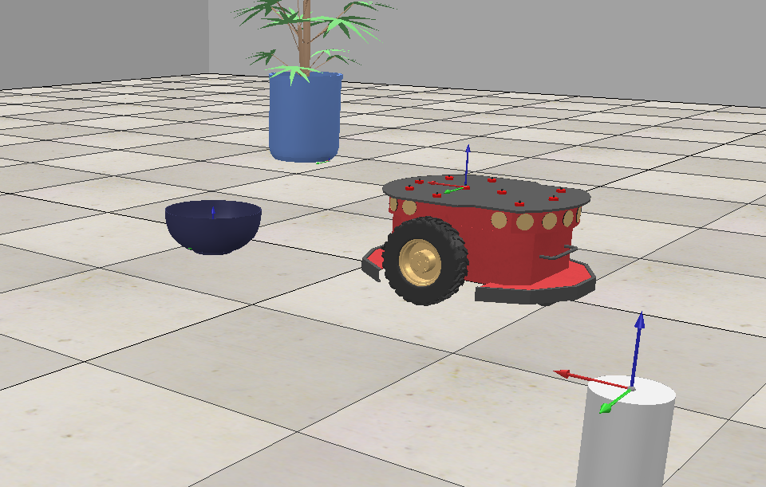

# Trabalho Prático 1 - Ferramentas e Transformações
**Weber Vieira de Souza**   
**2025719242** 


### Instalação 
- CoppeliaSim (https://www.coppeliarobotics.com/)
- coppeliasim-zmqremoteapi-client


## Como Executar

### Jupyter Notebook 

1. Navegue até o diretório do projeto:
   ```bash
   cd tp1_Weber
   ```

2. Inicie o Jupyter Notebook:
   ```bash
   jupyter notebook
   ```

3. Abra o arquivo `Tp1_Weber.ipynb`

4. Limpe as saidas  (Kernel → Clear All Outputs)

5. Execute todas as células em ordem

### CoppeliaSim 

1. Instale e configure o CoppeliaSim
2. Abra a cena `tp1_weber.ttt`
3. Configure a RemoteAPI

## Exercícios Implementados

### Exercício 1: Criação da Cena 
- Criação de ambiente com robô móvel e 5 elementos diferentes
- Visualização da cena completa


### Exercício 2: Sistemas de Coordenadas 
- Definição e visualização de sistemas de coordenadas
- Diagrama de transformações entre referenciais


### Exercício 3: Transformações Homogêneas 
- Implementação de matrizes de transformação homogênea 2D
- Cálculo de posições no referencial local do robô
- Visualização de referenciais e relacionamentos
As transformações homogêneas são fundamentais em robótica para representar a posição e orientação de objetos em diferentes sistemas de coordenadas. Uma transformação homogênea 2D é representada por uma matriz 3×3:

$$T = \begin{bmatrix}
\cos\theta & -\sin\theta & x \\
\sin\theta & \cos\theta & y \\
0 & 0 & 1
\end{bmatrix}$$

onde $(x, y, \theta)$ representa a configuração do robô no referencial global.

### Exercício 4: Múltiplas Posições 
- Teste com 3 posições diferentes do robô
- Variação de posição e orientação
- Verificação da implementação

### Exercício 5: Sensor Laser
- Integração do sensor laser com transformações
- Implementação das transformações Laser→Robô e Robô→Mundo
- Visualização em múltiplos referenciais

### Exercício 6: Navegação e Mapeamento 
- Sistema de navegação básica
- Mapeamento incremental
- Visualização de trajetória e mapa global


## Características Técnicas

### Transformações Implementadas
- Matrizes homogêneas 2D (3×3)
- Transformações diretas e inversas


### Sensor Laser


### Bibliografia

1. Craig, J. J. (2005). *Introduction to robotics: mechanics and control*.
2. Documentação oficial do CoppeliaSim: https://www.coppeliarobotics.com/
3. NumPy Documentation: https://numpy.org/doc/
4. Matplotlib Documentation: https://matplotlib.org/stable/contents.html